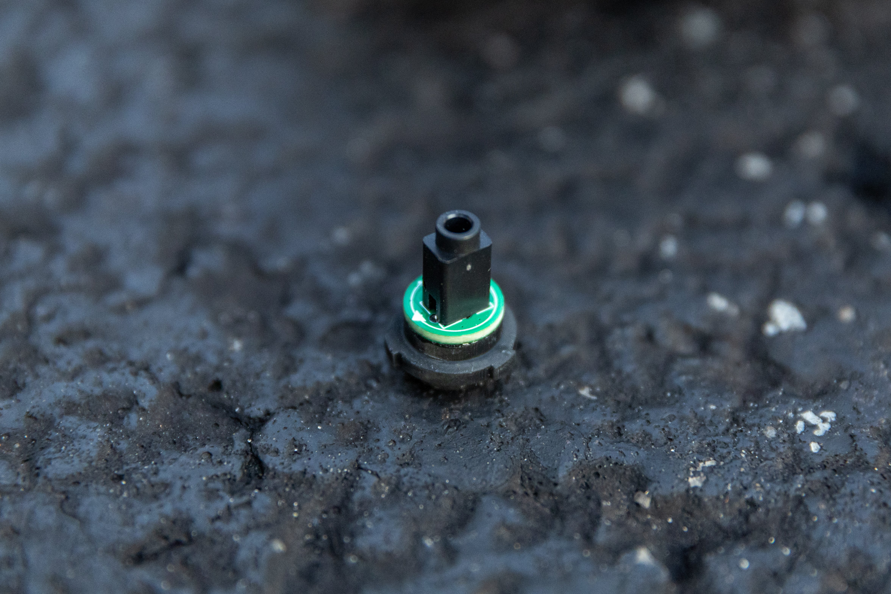
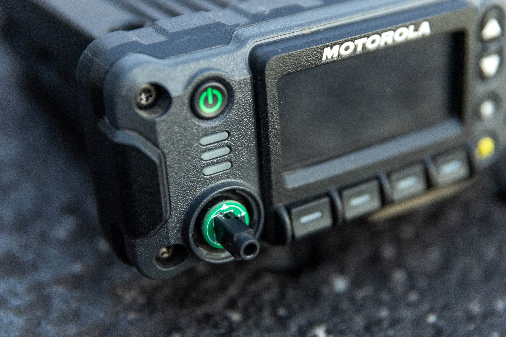

BBL6182™
========

The BBL6182 is a P25 keyloading adapter that enables the use of TIA-102 standards-compliant keyloaders with Motorola APX- and XTL-series mobile radios.

It provides comparable functionality to the Motorola HKN6182 keyloading adapter.

## 🛒 [Order now!](https://shop.beepbooplabs.ltd/products/bbl6182)

## Example usage

## Compatibility

The BBL6182 is designed and guaranteed to be compatible with all Motorola APX- and XTL-series mobile P25 radios, depending on the control head in use.

*Have you used a BBL6182 with a different radio? [Please let us know!](mailto:contact@beepbooplabs.ltd)*

### APX radios

The following control heads and configurations have been tested for compatibility at this time:

| Control head | Dash mount (CH mic port) | Remote mount (TIB MMP) |
|--------------|--------------------------|------------------------|
| O2           | ✅ Tested                | ✅ Tested              |
| O3           | ⚠️ N/A                   | ✅ Tested              |
| O5           | ✅ Tested                | ✅ Tested              |
| O7           | ✅ Tested                | ✅ Tested              |
| O9           | ⚠️ N/A                   | ✅ Tested              |
| E5           | ✅ Tested                | ✅ Tested              |

### XTL radios

The following control heads and configurations have been tested for compatibility at this time:

| Control head  | Dash mount (CH mic port)   | Remote mount (TIB MMP)     |
|---------------|----------------------------|----------------------------|
| O3            | ⚠️ N/A                     | ✅ Tested                  |
| O5 (XTL 5000) | ✅ Tested                  | ✅ Tested                  |
| M5 (XTL 2500) | ✅ Tested                  | ✅ Tested                  |
| MX (XTL 1500) | ✅ Tested                  | ⚠️ N/A                     |
| W-series      | ❌ Not supported[^wseries] | ❌ Not supported[^wseries] |

### Keyloaders

The BBL6182 is a passive adapter designed to meet the requirements of the TIA-102.AACD-A key fill device standard for P25 TWI (three-wire interface) keyloading.

The following TWI keyloaders have been tested for compatibility at this time:

| Keyloader                                                                                                                           | Support status | Firmware                   |
|-------------------------------------------------------------------------------------------------------------------------------------|----------------|----------------------------|
| [beep boop labs **bbl**key](https://github.com/beepbooplabsltd/bblkey)[^trs14totrs14]                                               | ✅ Tested      | 2.0.0                      |
| Motorola KVL 3000[^mxtotrs14]                                                                                                       | ✅ Tested      | 2.50.02                    |
| Motorola KVL 3000+[^mxtotrs14]                                                                                                      | ✅ Tested      | 3.53.03                    |
| [Motorola KVL 4000](https://www.motorolasolutions.com/en_us/products/p25-products/security/kvl-4000.html)[^mxtotrs14]               | ✅ Tested      | 1.3.5000.218 / SA R2.7.28  |
| [Motorola KVL 5000](https://www.motorolasolutions.com/en_us/products/p25-products/security/kvl-5000.html)[^mxtotrs14]               | ✅ Tested      | R01.08.01.00 / HSM 50.7.10 |
| [Motorola KVL 7000](https://www.motorolasolutions.com/en_us/products/p25-products/security/kvl-7000.html)[^gcaitotrs14]             | ❔ Untested    | —                          |
| [Tait EnableProtect KFD](https://www.taitcommunications.com/products/tait-enable-network-management/enableprotect#KFD)[^taittiabox] | ❔ Untested    | —                          |
| [KFDtool](https://store.kfdtool.com/)[^trs14totrs14]                                                                                | ✅ Tested      | 1.3.0                      |
| [KFDmini](https://www.ebay.com/itm/144716303249)[^trs17totrs14]                                                                     | ✅ Tested      | 1.3.0                      |
| KFDnano *([@alexhanyuan](https://github.com/alexhanyuan))*[^trs14totrs14]                                                           | ✅ Tested      | 1.8.7                      |
| [KFDnano](https://www.ebay.com/usr/rentfrowj) *([@rentfrowj](https://github.com/rentfrowj))*[^hirosetotrs14][^mxtotrs14]            | ✅ Tested      | 1.8.7                      |
| [KFDmicro](https://store.w3axl.com/products/kfdmicro-3d-printed-case-1)[^trs14totrs14]                                              | ✅ Tested      | 1.8.7                      |
| [KFDpico](https://www.ebay.com/itm/297004299797)[^trs14totrs14]                                                                     | ✅ Tested      | 1.7.3                      |

#### Cables

Unlike the comparable Motorola HKN6182 adapter, the BBL6182 uses a 3.5mm TRS (14mm) female jack.

This makes it compatible with many keyloaders using nothing more than a 3.5mm TRS (14mm) male-to-male cable, commonly referred to as an "aux cable" for audio.

The required cable for a given keyloader (listed above) can also be easily made using commodity electronics parts; simply follow the de-facto standard pinout for 3.5mm keyloading cables (hirose pinout for reference):

| TRS     | Signal | Hirose |
|---------|--------|--------|
| Tip     | Data   | Pin 2  |
| Ring    | Sense  | Pin 3  |
| Sleeve  | Ground | Pin 4  |

## Security design

As with any device that may come in contact with encryption key material, it is important to understand the security design and risk factors when using the BBL6182.

For more information, please review the in-depth discussion of the [BBL6182 security design](./security-design.md).

## Legal

The names "beep boop labs" and "BBL6182", and the alembic distiller logo, are trademarks and/or copyrighted works of beep boop labs ltd. All rights are reserved.

Any reference to KFDtool, Motorola, or any other third party manufacturer, or any of their products, is for informational purposes only. No representation is made that any such manufacturer has endorsed beep boop labs ltd or its products.

[^gcaitotrs14]: Requires Motorola [unreleased part number] portable GCAI to hirose male cable, combined with hirose female to 3.5mm TRS (14mm) cable.
[^hirosetotrs14]: Requires hirose male to 3.5mm TRS (14mm) cable.
[^mxtotrs14]: Requires Motorola TKN8531 MX to hirose male cable, combined with hirose female to 3.5mm TRS (14mm) cable.
[^taittiabox]: Requires Tait T03-00059-AAAA KFD to TIA radio adapter.
[^trs14totrs14]: Requires 3.5mm TRS (14mm) cable.
[^trs17totrs14]: Requires 3.5mm TRS (17mm) to 3.5mm TRS (14mm) cable.
[^wseries]: Requires Motorola TRN7414 hirose to W-series adapter.
